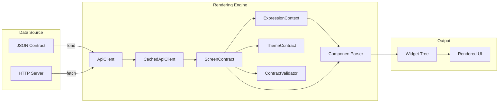
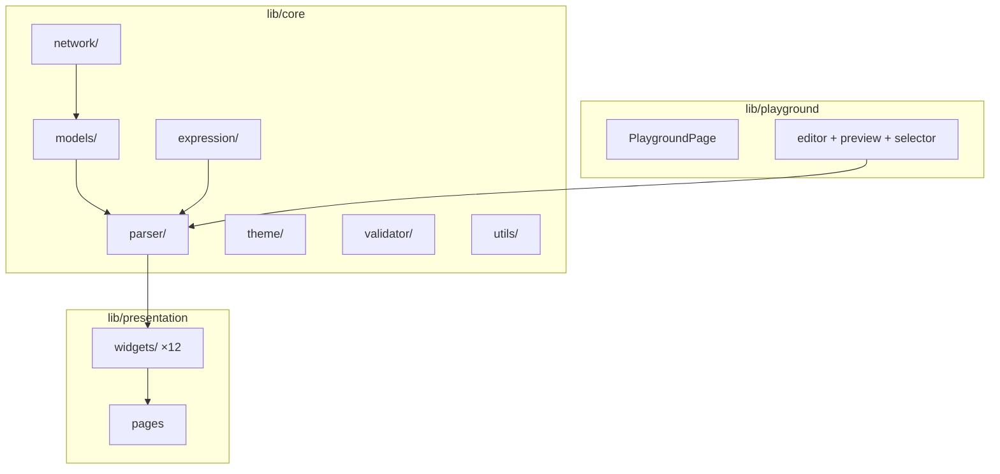

<div align="center">

# Server-Driven UI in Flutter

**Build dynamic screens from JSON contracts — zero hardcoded layouts.**


</div>

---

## Overview

A production-style **server-driven UI** architecture built entirely with Flutter and Dart. Every layout, component, and navigation action is defined by JSON contracts that the engine renders dynamically at runtime.

In a server-driven UI (also called Backend-Driven Content), the client is a **generic rendering engine**. Instead of writing widgets for each screen, you define screens as data — a JSON tree describing which components to render, how to lay them out, and what actions they trigger.

---

## Data Flow



---

## Architecture



---

## Features

### Components (19 types)

| Category | Components |
|----------|-----------|
| **Layout** | `column` · `row` · `container` · `card` · `listView` · `stack` · `positioned` · `wrap` · `spacer` |
| **Leaf** | `text` · `button` · `image` · `input` · `divider` · `icon` · `chip` · `progress` · `badge` |
| **Interactive** | `switch` · `checkbox` |

### Actions (7 types)

`navigate` · `snackbar` · `submit` · `goBack` · `openUrl` · `copyToClipboard` · `showDialog`

### Engine Capabilities

- **Expression Engine** — `{{variable}}` template interpolation and conditional visibility
- **Dynamic Theming** — per-screen color, typography, and brightness from JSON
- **Contract Validation** — schema checks before rendering with detailed warnings
- **Remote API + Caching** — `HttpApiClient` for HTTP fetching, `CachedApiClient` with TTL
- **Playground** — live JSON editor with split-view preview, screen selector, and auto-render

---

## Demo Screens

| Screen | Description |
|--------|-------------|
| `home` | Welcome page with navigation to all demos and a banner image |
| `profile` | User profile with avatar, details card, and snackbar action |
| `form` | Feedback form with text inputs and submit |
| `components_showcase` | Every component type in one screen |
| `expressions_demo` | Template interpolation and conditional visibility |
| `theme_demo` | Dark theme applied via JSON contract |

---

## Quick Start

```bash
flutter pub get
flutter run
```

The landing page offers two modes:

- **App Demo** — navigate through pre-built screens loaded from `assets/screens/`
- **Playground** — edit JSON contracts and preview rendered output in real-time

---

## JSON Contract Example

```json
{
  "schemaVersion": "1.0",
  "context": {
    "user": { "name": "Jane" }
  },
  "theme": {
    "primaryColor": "#820AD1",
    "brightness": "dark"
  },
  "screen": {
    "id": "example",
    "title": "Hello",
    "root": {
      "type": "column",
      "props": { "crossAxisAlignment": "stretch", "padding": 24 },
      "children": [
        {
          "type": "text",
          "props": { "content": "Hi, {{user.name}}!", "style": { "fontSize": 24 } }
        },
        {
          "type": "button",
          "props": { "label": "Go to Profile" },
          "action": { "type": "navigate", "targetScreenId": "profile" }
        },
        {
          "type": "card",
          "visible": "{{user.name}}",
          "props": { "padding": 16 },
          "children": [
            { "type": "text", "props": { "content": "Visible only when user.name is truthy" } }
          ]
        }
      ]
    }
  }
}
```

---

## Project Structure

```
├── assets/screens/                        # JSON screen contracts
│   ├── home.json
│   ├── profile.json
│   ├── form.json
│   ├── components_showcase.json
│   ├── expressions_demo.json
│   └── theme_demo.json
├── lib/
│   ├── main.dart                          # App entry with dynamic routing
│   ├── core/
│   │   ├── core.dart                      # Barrel export
│   │   ├── expression/
│   │   │   ├── expression_context.dart    # Variable bindings + dot-path resolution
│   │   │   └── template_engine.dart       # {{var}} interpolation + visibility
│   │   ├── models/
│   │   │   └── screen_contract.dart       # ScreenContract, ComponentNode, ActionDef
│   │   ├── network/
│   │   │   ├── api_client.dart            # Abstract client interface
│   │   │   ├── local_api_client.dart      # Loads JSON from bundled assets
│   │   │   ├── http_api_client.dart       # Fetches contracts via HTTP
│   │   │   └── cached_api_client.dart     # In-memory cache with TTL
│   │   ├── parser/
│   │   │   ├── component_parser.dart      # Recursive tree → widget builder
│   │   │   └── component_registry.dart    # Type → builder function map
│   │   ├── theme/
│   │   │   ├── app_colors.dart            # Nubank color palette constants
│   │   │   └── theme_contract.dart        # Per-screen theme from JSON
│   │   ├── utils/
│   │   │   └── color_utils.dart           # Shared hex color parser
│   │   └── validator/
│   │       └── contract_validator.dart    # Schema validation with warnings
│   ├── presentation/
│   │   ├── presentation.dart              # Barrel export
│   │   ├── dynamic_screen_page.dart       # Fetch + render + error handling
│   │   ├── landing_page.dart              # Mode selection (demo / playground)
│   │   └── widgets/
│   │       ├── server_text.dart
│   │       ├── server_button.dart
│   │       ├── server_image.dart
│   │       ├── server_input.dart
│   │       ├── server_divider.dart
│   │       ├── server_icon.dart
│   │       ├── server_chip.dart
│   │       ├── server_progress.dart
│   │       ├── server_badge.dart
│   │       ├── server_switch.dart
│   │       ├── server_checkbox.dart
│   │       └── unknown_component.dart
│   └── playground/
│       ├── playground.dart                # Barrel export
│       ├── playground_page.dart           # Split-view editor + preview
│       ├── playground_api_client.dart     # In-memory JSON parsing
│       └── widgets/
│           ├── json_editor_panel.dart
│           ├── preview_panel.dart
│           └── screen_selector.dart
├── docs/
│   └── ARCHITECTURE.md                    # Full schema specification
├── pubspec.yaml
└── README.md
```

---

## Adding a New Screen

1. Create a JSON file at `assets/screens/your_screen.json`
2. Reference it from any button action:

```json
{ "type": "navigate", "targetScreenId": "your_screen" }
```

No Dart code changes needed.

## Adding a New Component

1. Create a builder function in `lib/presentation/widgets/`
2. Register it in `ComponentParser._registerDefaults()`:

```dart
_registry.register('yourType', buildYourComponent);
```

---

## Documentation

- [Architecture & Schema Specification](docs/ARCHITECTURE.md)

---

## Tech Stack

| Concern | Technology |
|---------|-----------|
| Language |  |
| Framework |  |
| Design System |  |
| Data Format |  |
| Architecture | Server-Driven UI / Backend-Driven Content |

---

## Screenshots

> Run the app and capture screenshots to add here.

| Landing | Home | Components | Playground |
|---------|------|------------|------------|
| *landing* | *home* | *components showcase* | *playground* |

---

<div align="center">

Built with Flutter + Material Design 3

</div>
